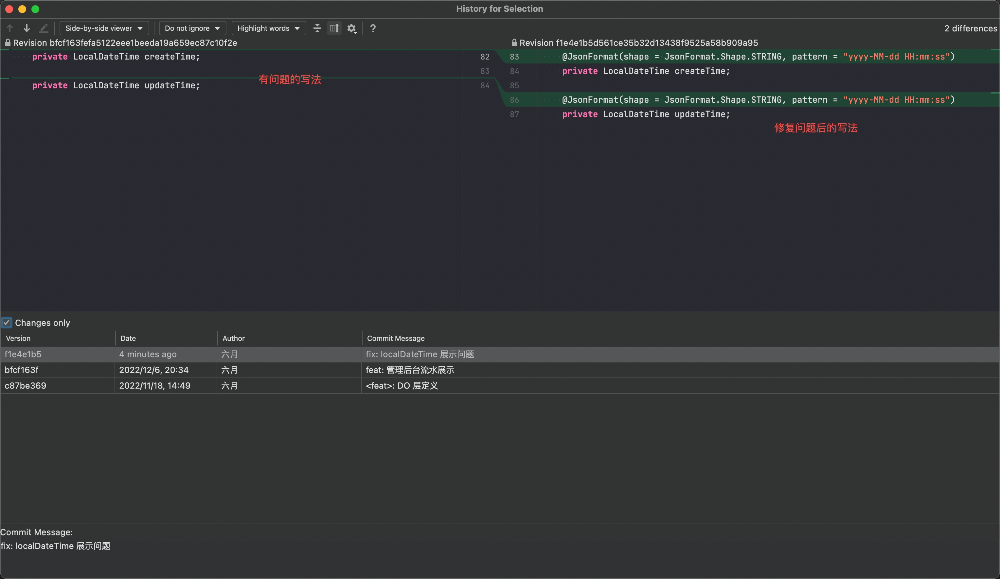
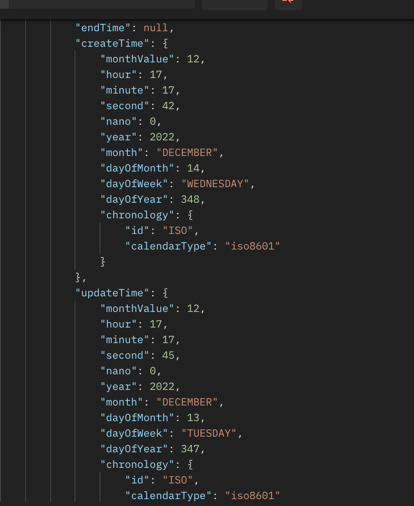

# 汇总开发过程中踩过的序列化坑

## LocalDateTime 在前端展示问题
代码写法如下所示

前端看到的数据格式：


改造动作
```java
    @JsonSerialize(using = LocalDateTimeSerializer.class)
    @JsonDeserialize(using = LocalDateTimeDeserializer.class)
    private LocalDateTime createTime;
    @JsonSerialize(using = LocalDateTimeSerializer.class)
    @JsonDeserialize(using = LocalDateTimeDeserializer.class)
    private LocalDateTime updateTime;
```


